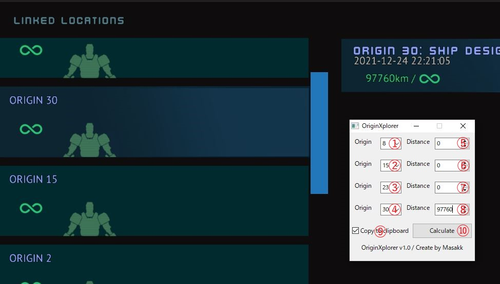

# SB_OriginXplorer

## what is this app

This is an app that calculates the current three-axis coordinates based on the distances from four Origin Stations.

## Screen Annotation & Usage

* ① ~ ④ Select Origin.
* ⑤ ~ ⑧ Enter the distance to Origin (km).
* ⑨ If you want to copy to the clipboard, check the box.
* ⑩ Calculation.

## Features to be added

* Advance Mode for free input of coordinates.
* Review distribution format, exe -> html + js (undecided).
* Displaying a map using Three.js (undecided).
